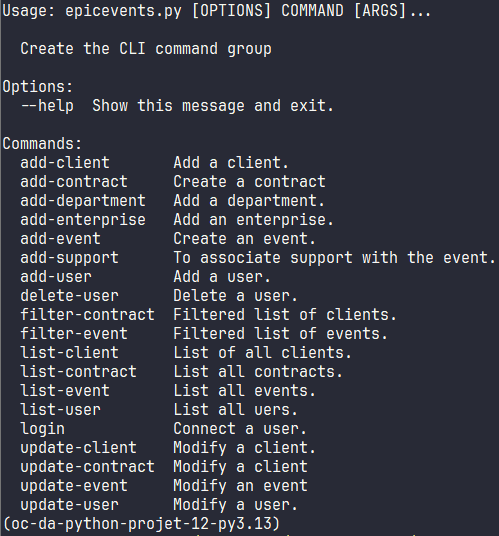
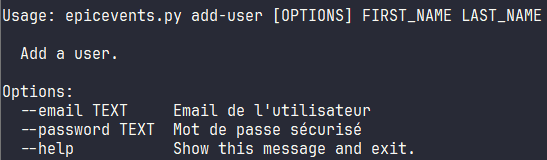

# Epic Events

Epic Events est une entreprise de conseil et de gestion dans l'événementiel qui répond aux besoins des start-up voulant organiser des « fêtes épiques ».
Ce programme constitue le premier CRM de l'entreprise.

Etapes à suivre pour installer localement l'application :

1. **Cloner le repository GitHub du projet**
    * `git clone https://github.com/meridien22/epic_events.git`
2. **Aller dans le répsertoire du projet**
    * `cd epic_events/`
3. **Si vous n'avez pas poetry sur votre machine, installez-le avec cette commande**
    * `curl -sSL https://install.python-poetry.org | python3 -`
4. **Créer l'environnement virtuel et installer les bilbiothèques**
    * `poetry config virtualenvs.in-project true`
    * `poetry install --no-root --without dev`
5. **Activer l'environnement virtuel**
    * `source .venv/Scripts/activate`
6. **Créer un répertoire private avec un fichier parameter.py contenant :**
```python
parameter = {
    "name_db": "XXX",
    "user_db": "XXX",
    "password_db": "XXX",
    "schema_db": "XXX",
    "ssh_private_key_file": r"XXX",
    "ssh_public_key_file": r"XXX",
    "ssh_private_key_password": "XXX",
    "password_sales": "XXX",
    "password_support": "XXX",
    "password_management": "XXX",
    "password_admin": "XXX",
    "sentry_dns": "XXX",
}
```
> **Note à propos de la base de données :**  
Au préalable, une base de données PostgreSQL doit être installé en local.  
Vous devez adapter les paramètres **_db** à votre environnement.  
password_sales, password_support, password_management et password_admin correspondent  
au mot de passer des différents type d'utilisateur de votre CRM.

> **Note à propos des JSON Web Token :**  
Pour pouvoir utiliser les JWT vous devez utiliser une par de clé RSA.  
Vous devez adapter les paramètres **ssh_** à votre environnement. 

> **Note à propos de Sentry :**  
L'application utlise Sentry pour la gestion des logs.  
Vous devez adapter le paramètre **sentry_dns** en fonction de votre compte Sentry.


7. **Initilaiser la base de données avec cette commande :**
    * `python setup_db.py`
8. Consulter l'ensemble des commandes proposés par le programme :*
    * `python epicevents.py`



9. Consulter l'aide sur une commande :
    * `python epicevents.py add-user --help`

